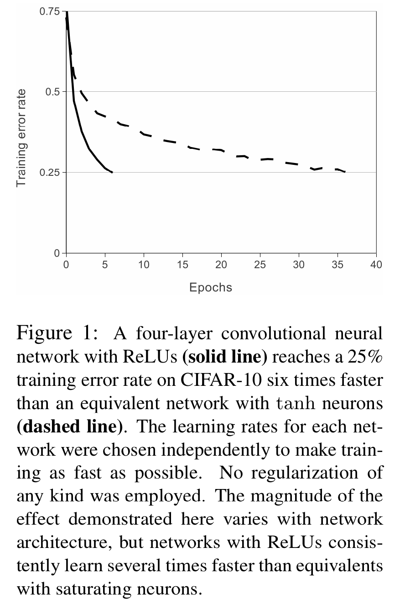

# AlexNet

kaishen, 28 Feb, 2018

The original paper can be found [here](https://papers.nips.cc/paper/4824-imagenet-classification-with-deep-convolutional-neural-networks.pdf).

If you are not familiar with CNN(Convolutional Neural Networks), or I forget it after sometime, please refer to this great [post](http://cs231n.github.io/convolutional-networks/). Or [here](https://github.com/Oukaishen/PaperNotes/blob/master/materials/CS231n%20CNN%20note.pdf), in case the former link is gone.

The network architecture is shown below, I **acknowledge** that this picture is taken from Standford CS231n course.

*If you are confused by the first layer 224 shown in the original picture while the 227 listed in the schema, it turns out that the origianl author pad three lines of blank.*

## Some Key points

1. The first paper demonstrates the CNN is good at picture classifications. Up to now(28 Feb 2018), it is referenced more than 20,000 times in google scholar.
2. The first paper to demonstrate the ReLU(Rectified Linear Unit) is several times faster than the traditional non-linearities, such as sigmoid, tanh, etc.

3. Two method of Data Augumentations, details can be found in the paper. More importantly, how to understand this sentence?

> Without this scheme, our network suffers from substantial overfitting, which would have forced us to use much smaller networks.

Personally, this is an extremely good example to understand **overfitting**. According to Goodfellow's [book](http://www.deeplearningbook.org/contents/ml.html),

> **Overfitting** occurs when the gap between the training error and test error is too large.

Back to this case of AlexNet. The author want to use AlexNet, which has about 60M(million) parameters. This because with more parameter, the model of course has more capacity, better ability to represent any funtion, better ability for calculation, whatever. But with so manay parameters, small data is hard/not enough to feed the model. And the model may just "remember" the surface things, instead of "learning" the internl relations inside the model. To paraphrase, in an more mathematical way, it is very hard to find one good function in such a large function space(60M parameters). The result is that the result model has poor generalization ability. In Chinese, 这个模型死记硬背，没有真正理解，所以train error很好，但是test error很差（换一道题就不会了）。

For comparison, if you have 60M candidates for one job, without any doubt you have better chance to get a smarter person than if you only have 60 canditates. However, on the hand, you are much more difficult to choose the appropriate one from 60M than from 60. 

Finally, come back to the above sentence by the author, if he cannot figure out a way to feed the model enough data, he would be forced to use samller networks. Similarly, if you are too lazy, you had better choose one from 60 candidates.

4. Dropout, also reduce the overfitting effect. Quiter useful technique, not much to say.

5. > This initialization accelerates the early stages of learning by providing the ReLUs with postive inputs.

6. The weight decay is of importance, intead of being merely a regularizer.

