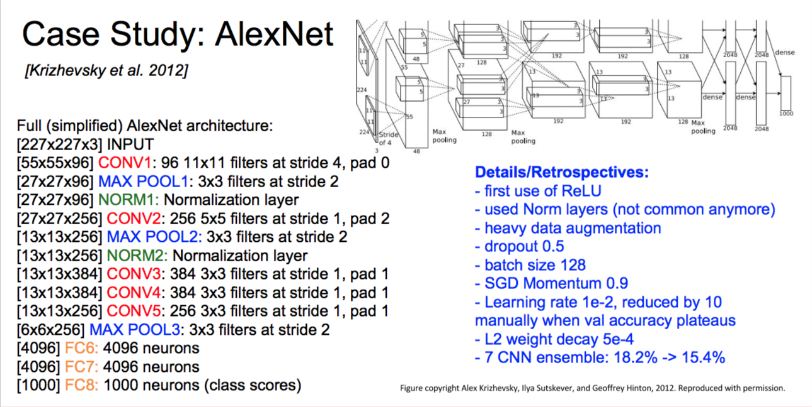

---
mathjax:true
---

# AlexNet

kaishen, 28 Feb, 2018

The original paper can be found [here](https://papers.nips.cc/paper/4824-imagenet-classification-with-deep-convolutional-neural-networks.pdf).

If you are not familiar with CNN(Convolutional Neural Networks) or I forget it after sometime, please refer to this great [post](http://cs231n.github.io/convolutional-networks/). Or [here](./materials/CS231n CNN note), in case the former link is gone.

The network architecture is shown below, I **acknowledge** that this picture is taken from Standford CS231n course.

*If you are confused by the first layer 224 shown in the original picture while the 227 listed in the schema, it turns out that the origianl author pad three lines of blank.*

## Some Key points 

1.The first paper demonstrates the CNN is good at picture classifications. Up to now(28 Feb 2018), it is referenced more than 20,000 times in google scholar.

