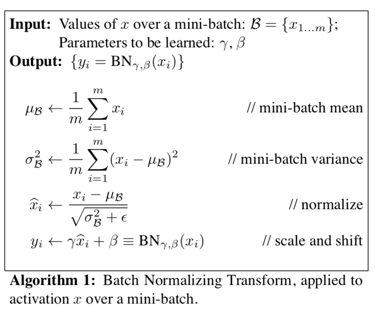
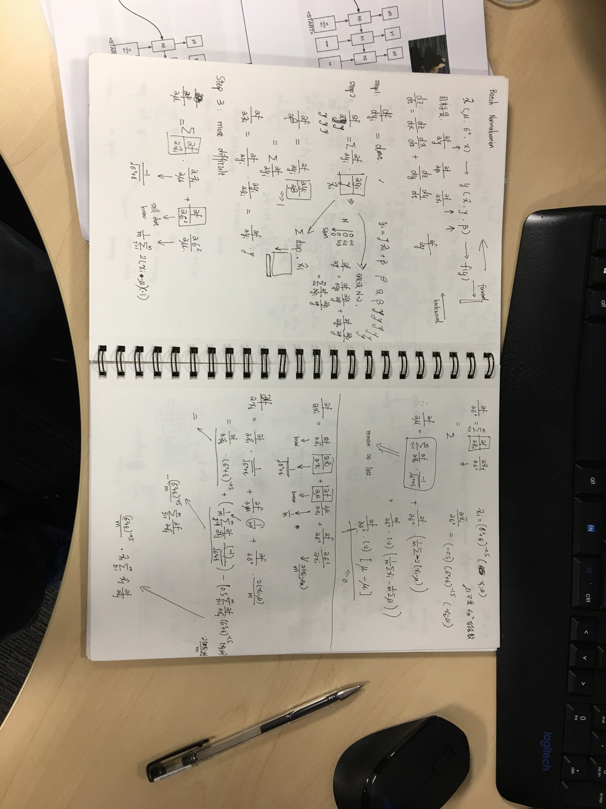

# Batch Normalization 

kaishen, 2 Mar, 2018

The original paper can be found [here](http://proceedings.mlr.press/v37/ioffe15.pdf).

This is one of my **favourite** paper in the Deep Learning area. I will continually update this post when i got deeper understanding on this field.

## Important thing first

Bear in mind, BN(Batch Normalization) is a technique that can significantly accelerate Deep Network training. In case of too many knowledge points making you confused, just remember, it can accerelate the training. Accept this, and then we try to learn **how to use this technique**, and then **why it works**.

## Implementation of BN 

> The first is that instead of whitening the features in the layer inputs and outputs jointly, we will normalize each scalar features independently, by making it have the mean of 0 and the variance of 1.

This simplication can be shown in this code snippet, note that the opertiaon is column-based (each diemension operates independently).

```python
        mean = np.mean(x, axis = 0)
        var  = np.var(x, axis = 0)
        x_hat = ( x - mean ) / np.sqrt(var + eps)
        out = gamma * x_hat + beta

        cache = (mean, var, x_hat, eps, gamma,  beta)
```

The $\gamma$ and $\beta$ are learned parameters, and they will be updated during the training procedure.

The original algorithm for doing the BN is shown follow.



> During training, we need to backpropagate the gradient of loss $L$ through this transformation, as well as compute the gradients with respect to the parameters of BN transform.


If you are not familiar with the chain rule, and don't understand how they are coumputed, never mind. First check this equation in this [wiki](https://en.wikipedia.org/wiki/Chain_rule).

<div style="text-align:center">

$\frac{\partial y}{\partial x_i}=\sum\limits_{l=1}^{m} \frac{\partial y}{\partial u_l} \cdot \frac{\partial u_l}{\partial x_i}$

i.e.

$\frac{\partial u}{\partial r}=\frac{\partial u}{\partial x} \cdot \frac{\partial x}{\partial r} + \frac{\partial u}{\partial y} \cdot \frac{\partial y}{\partial r} $

</div>

Then you can check this great [post](https://kevinzakka.github.io/2016/09/14/batch_normalization/). In case of the post is hang, I have my own derivation. 

The code snippet for BN backpropagation is shown as follow

```python
	mean, var, x_hat, eps, gamma, beta = cache
    dgamma = np.sum(dout * x_hat , axis = 0)
    dbeta  = np.sum(dout, axis = 0)
    N = dout.shape[0]
    dxhat = dout * gamma
    #this equation comes from the derivation, refer to https://kevinzakka.github.io/2016/09/14/batch_normalization/
    dx = (N*dxhat - np.sum(dxhat, axis = 0) - x_hat * np.sum(x_hat * dxhat, axis = 0))/(N*(np.sqrt( var +eps )))
```

For all of the above code, can be found [here](https://github.com/Oukaishen/CS231n_Spring2017/blob/master/assignment2/BatchNormalization.ipynb).

## Understanding the BN

To be honest, understanding why BN works is not easy. There are too many knowledge points, whcih are difficult to consider them at the same time, and connetc them together. I wirte this post in case of forgeting some of the points and I will update this part when I get new understanding. 

If you want to check how [Ian Goodfellow](https://github.com/Oukaishen/NiuBiPeople/blob/master/Ian%20Goodfellow.md) describes BN, please check [here](https://www.youtube.com/watch?v=Xogn6veSyxA&t=664s&list=PLRKBCmsJy0FvM-bHP78UVbgcPTi0WgCub&index=1).

If you want to check how CS231n describes BN, please check [here](https://www.youtube.com/watch?v=wEoyxE0GP2M&index=6&list=PL3FW7Lu3i5JvHM8ljYj-zLfQRF3EO8sYv).

---

In the following discussion, I want to stick to [sigmoid](https://en.wikipedia.org/wiki/Sigmoid_function) activation function cause it may be clearer to show the saturation. Consider such a forward pass in a DNN(Deep Nerual Network)

> affine1 -> BN1 -> sigmoid1 -> affine2 -> BN2 -> sigmoid2

### point 1

As shown in the pciture, the output of the affine1 layer may follow this distribution(just for illustration).


If this goes directly into the sigmoid1, obviously most of them will go into the saturation region of sigmoid. Later in the backward pass, those gradients will be zero, and lead to slowly training (aka gradient vanishing).

On the other hand, with BN1, the output distribution is map to this distribution. Initially, $\gamma$ is set to 1 while $\beta$ is set to 0, which is just an [unit gaussian distribution](https://en.wikipedia.org/wiki/Normal_distribution).


Think in this way, BN provides a relatively "fixed" distribution for the layers in behind. For example, the $W2$ and $b2$ in the affine2 layer will take following as input. 

$y_i = \gamma \hat x_i + \beta$

$sigmoid(y_i)$

 Here, the $\hat {x_i} \sim \mathcal {N}(0,1)$, if $\gamma$ and $\beta$ changes gradually and slowly, the $y_i$ distribution is stable. In this sense, the output of $sigmoid(y_i)$ is more stable, which means, **the $W2, b2$ dont have to readjust too much to compensate the change in the $W1, b1$**.  Although changes in $W1 , \ b1$ will change $x_i$ 's distribution, but $\hat{xi}$ remains the $\mathcal {N}(0,1)$, and $y_i$'s distribution is controlled by $\gamma$ and $\beta$. That means sigmoid1's input is quite stable, then $W2, b2$ need not always hugely readjust themselves to adapt another distribution. Think of there are many layers, this actually saves a lot effort. This somewhat seems like there is a barrier(||) to stop the changes in this layer to affect the next layer.

> changes in affine1 -> || -> sigmoid1 -> changes in affine2 -> || -> sigmoid2

### point 2

In the backward pass, since most of the activation (sigmoid) is inside the linear region, the cases that gradient is zero are reduced. So BN can alleviate gradient vanishing problem. 

### point 3

> Batch Normalization also makes training more resilient to the parameter scale.

This enables higher learning rates.

### point 4

$\gamma $ and $\beta$ can be learnd, this increase the model's flexibility and represent power


