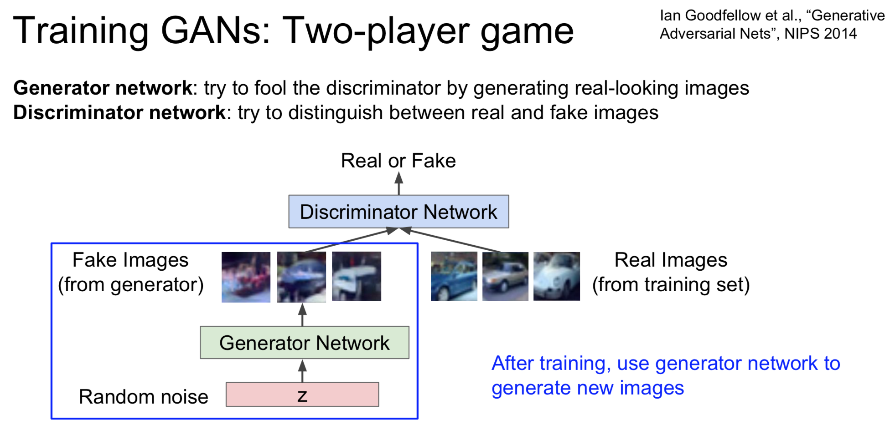

## Generative Adversarial Nets Notes

created by Kaishen, Feb 9, 2018

#### Easy Understanding

In this part, I want to introduce the GAN to you without any detailed mathematics. 

First of all, GAN, as stated in its name, is a generative model. You may ask, why we need generative model or what it can give us. Informally, generative model has the ability to create **"new samples"** that are similar to the origin samples. 

For example, in normal Machine Learning an Deep Learning scenario, we are often provided some samples and asked make a model to handle them. But what if the task changes to generate some similar samples based on the given sample? I.e. we need more pictures that are similar to the CIFAR10. Then GAN can help.

***In short, GAN can generate something new based on the things you feed it.***

How does GAN achieve this? The secret is also inside the name, **"Adversarial"**. GAN has two neural network, generator and discriminator. The generator creates the new (orignal paper call it fake) samples, and the  discriminator try to distinguish the new sample from those trues samples you gave. See the below diagram.

The generator and the Discriminator are just like two players, who are competing with each other. This is the reason why people call this kind of method Adversarial.

After training, both neural networks are good, then we will use the generator network to generate new images.

#### Deep Understanding

First of all, we have to thank Ian J. Goodfellow for his great [paper](https://arxiv.org/abs/1406.2661). I acknowledge all of the bellow material are just notes for undertanding Ian's paper.

#### Terms

$p_z$ The probaility distribution of input noise variables $z$, which is also known as "latent variable". The $p_z$ is defined by us, someone also calls it prior distribution.

$G(z;\theta_g)$ The differentiable mapping/function maps the latent variable $z$ space to data $x$ space. Simply, it is just $x=G(z)$ . In GAN, this funtion is called **generator**, and is by formed by an neural network. This is also the target network we want to learn through the whole story.

$p_g$ The generator's output distribution, i.e. the probability distributon of $G(z)$ obtained when $z\sim p_z$. Since $x=G(z)$, can think this as probability distribution of **generated/faked** samples.

$D(x;\theta_d)$ The function that maps input $x$ to a single scalar range inside the $[0,1]$, representing the probability that input $x$ came from the true data rather than $p_g$. To be more specific, an $x$ whose $D(x)$ is close to 1, has higher change that this $x$ coming from real data, i.e. probably a real sample. This $D(x)$ function is called **discriminator**, also a neural network.

$p_{data}$ The true data generating distribution.

***Our ultrimate goal is to make the $p_{data}=p_g$, i.e. learn the true data distribution.***

#### Object Function

Usually at this time, they will give out the following object function and tell you to do a minimax game.

$\underset{G}{\min}\underset{D}{\max}V(D,G)=\mathbb{E}_{x\sim p_{data}}[\log D(x)]+\mathbb{E}_{z \sim p_z(z)}[\log (1-D(G(z)))]$

But why this object function? How to understand this object function? How does the expectation symbol $\mathbb{E}$ come out? Here is a great [post](https://danieltakeshi.github.io/2017/03/05/understanding-generative-adversarial-networks/) which I also list in the references. I will follow some of this post, but also provide my own explanation.

I would like to represent the data as $(x_i, y_i)$, where $i$ stands for the ith sample of a minibatch.

 $x_i \in \mathbb{R^n}$ , this is the input data space.

 $y_i \in \{0,1\}$, this indicates whether the data is generated from true distribution, i.e. sample from true data set. Or, the data is generated from input noise variable $z$, and get $x=G(z)$. We can say that every former is $(x_i, y_i=1)$ and all of the latter are $(x_i,y_i=0)$. We should conside this $y_i$ as part of input data intead of label. Cause we know it when we sample from the data, no need to do extra label work, it is somewhat like a singal/flag. 

$D:\mathbb{R^n} \rightarrow [0,1]$ turn the input data into one scalar, the possibility that $x$ is from true distribution.

In this way, we can consider the conditional possibility $P(Y=y_i\vert x_i)$ as follows:

$P(Y=y_i\vert x_i)=D(x_i)^{y_i} \cdot (1-D(x_i))^{1-y_i}$

Since there is a minibatch of samples, including both the real data and the **generated** data from $z$ .

$J=\frac{1}{2n}\prod\limits_{i=1}^{2n} P(Y=y_i\vert x_i)=\frac{1}{2n}\prod\limits_{i=1}^{2n} D(x_i)^{y_i} \cdot (1-D(x_i))^{1-y_i}$

Taking $\log$ of two sides, 

$\log J=\frac{1}{2n}\sum\limits_{i=1}^{2n}[y_i\cdot\log(D(x_i)) + (1-y_i)\cdot\log(1-D(x_i))]$

This is close to the Objection listed above, right? We would like to maximize this log-likelihood for the **discriminator**. This is enough for the code and programming.

---

But the key is how to **turn this sum into the expectation** in the previous formula. 

**<u>Warning:</u>** below may not be very rigorous, but my way of understanding. May be changed in the future when I have deeper understanding.

We know that, we will sample $n$ data points from the true data set, sample another $n$ data points from $z$.

All the $x_i \in p_{data} $ have $y_i =1$, while all the $x_i \in p_g$ have $y_i=0$. If we take each data's contribution(to loss) into account, we can get

$\log J=\sum\limits_{i=1}^{n}p_{data}[y_i\cdot\log(D(x_i)) + (1-y_i)\cdot\log(1-D(x_i))]+\sum\limits_{i=1}^{n}p_{g}[y_i\cdot\log(D(x_i)) + (1-y_i)\cdot\log(1-D(x_i))]$

$\log J=\sum\limits_{i=1}^{n}p_{data}[1\cdot\log(D(x_i)) + (1-1)\cdot\log(1-D(x_i))]+\sum\limits_{i=1}^{n}p_{g}[0\cdot\log(D(x_i)) + (1-0)\cdot\log(1-D(x_i))]$

$\log J=\sum\limits_{i=1}^{n}p_{data}\log(D(x_i))+\sum\limits_{i=1}^{n}p_{g}\log(1-D(x_i))$

$\log J = \mathbb{E}_{x \sim p_{data}}[\log D(x)]+\mathbb{E}_{z \sim p_z(z)}[\log (1-D(G(z)))]$ 

$\mathbb{E}_{x \sim p_{data}}[\log D(x)]+\mathbb{E}_{z \sim p_z(z)}[\log (1-D(G(z)))]$

If we maximize this $\log J$, we can get a good **discriminator**, on the other hand, if we minimize it, we obtain a good **generator**.

#### Questions

1.Why we need to train the $D$ first before we train the $G$ ?

>The reason is that 

.jpg)

#### References

https://danieltakeshi.github.io/2017/03/05/understanding-generative-adversarial-networks/