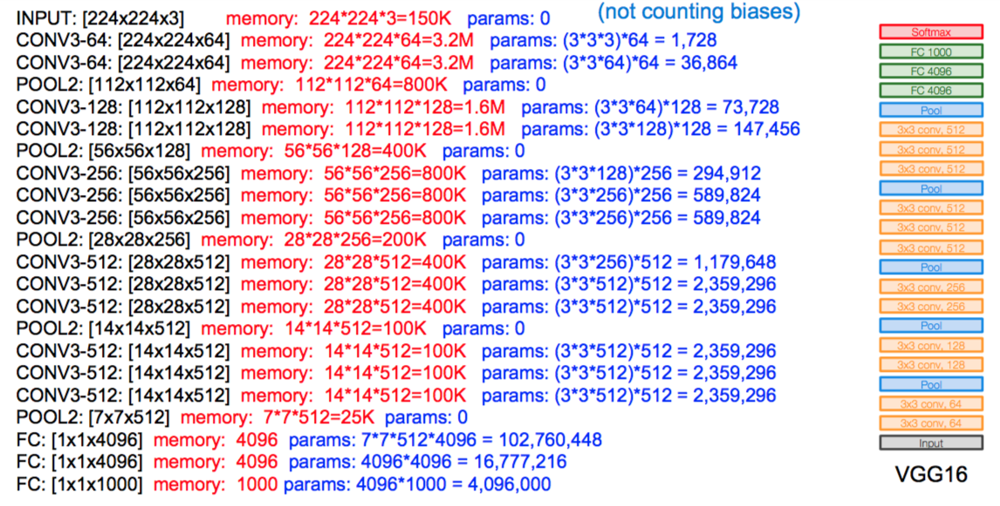
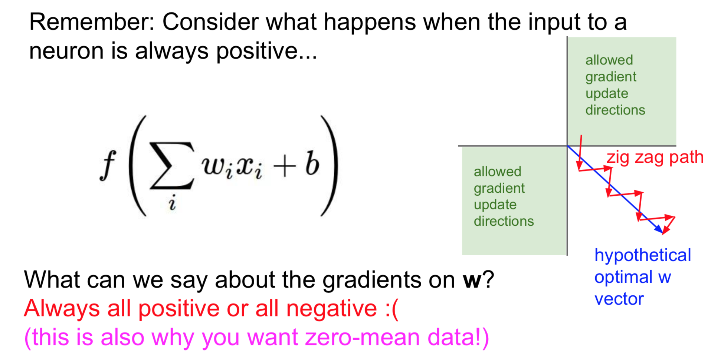

# VGG Net 

kaishen, 1 Mar, 2018

The original paper can be found [here](https://arxiv.org/abs/1409.1556). 

The network architeture is shown below, I **acknowledge** that this picture is taken from Standford CS231n course.

## Some Key Points

1.Pre-process the pictures. 

> The only pre-processing we do is subtracting the mean RGB value, computed on the training set, from each pixel.

Why do this? **To make the training data _zero centered_**. Making the input zero centered can help the initial gradient back-propagation goes smoothly. Otherwise, if the input are all positive or all negative at the beginning, the gradient of parameters will also be all positve or negative at start. The will lead to a longer way to arrive at parameters' optimal value, cause it is restricted among certain directions. i.e. all positive direction. See the below shema for 2-Dimensional example.

2.Use small receptive-field Conv filters, i,e, size of 3x3. 

> Our main contribution is a thorough evaluation of networks of increasing depth using an architecture with very small (3 x 3) convolution filters.

Two advantages can be obtained by using a stack of three 3x3 filters compared to using one 7x7 filter.

> First, we incorporated three non-linear rectification layers instead of a single one, which makes the decision function more discriminative. 

This first point is quite clear and no need to explain. Obviously, more non-linearities lead to larger function space.

> Second, we decrease the number of parameters. (kaishen: without losing much ability of represent)

The second point can be demonstrates quantitatively. Assuming that both the input and output of a three-layer 3x3 convolutions has **C** channels. Then the stack has $3 \times [C \times (3 \times 3 \times C)] = 27C^2$ parameters. On the other hand, the single 7x7 filter has $C \times (7 \times 7 \times C) = 49C^2$ parameters. The reduction ratio is about 81%.

3.Training procedure of this deep neural network (16 and 19 layers).

> To be noticed that, this VGG model is invented before the Batch Normalization technique comes out. So the training procedure is a little bit tricky. After BN comes out, some of those tricky techniques are no longer necessary. The Batch Normalization paper can be found [here](http://proceedings.mlr.press/v37/ioffe15.pdf).

During the training of the VGG 16, the author actually trained the first 11 layers. After that is converged, it continued to train the thereafter layers.

4.Incorporation of 1x1 conv layers.

> It is a way to increase the non-linearity of the decision function without afftecting the receptive field.

